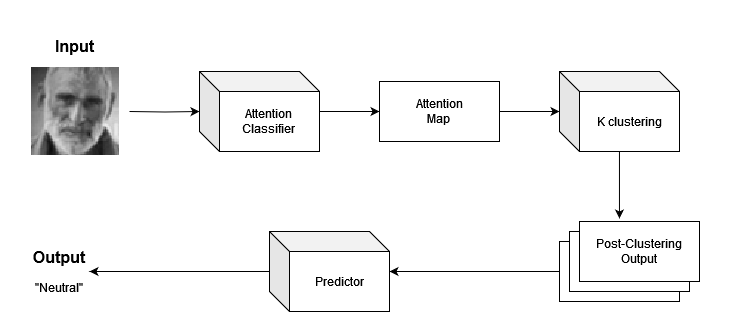
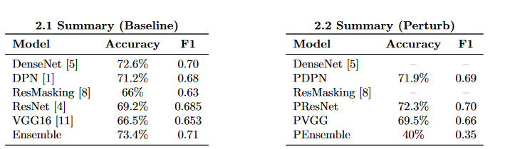

# Code for "Some Facial Landmarks Should Be Left Alone"
1. Install dependencies by using `pip install -r requirements.txt`
2. Navigate to `/data` and run `bash getDataset.sh` to extract the dataset into the current folder

The proposed training method is consist learning the clustering of features. Base on the attention, segment the image into different local features and train a classifier model on these new information. 

The following tables shows the performance of different models for facial emotion recognition.

